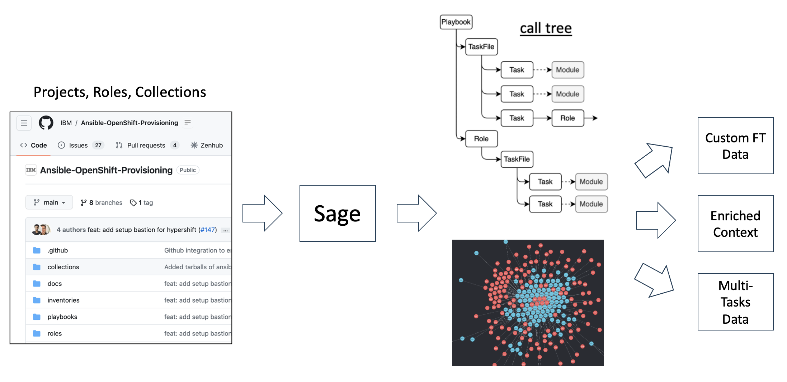

# Sage Project

Sage is a framework for Ansible repository scan to create graph/intermediate/high level representation of data that can be downstream converted to ftdata. The project includes practical examples for generating/processing task data such as 
- Creating training data specific to a customer repository ([link](./doc/custom-repo-scan.md))
- Adding enriched context to existing fine-tuning data set ([link](./doc/enrich-context.md))
- Creating training dataset for multi-task generation ([link](./doc/new-train-data.md))




## Sage Data Representation

Sage scan the project and create object tree which consists of Ansible specific nodes like
- collections (all external dependencies)
- modules (name, fqcn, spec)
- playbooks (name, comment, filename)
- plays (name, comment, calling tasks and roles)
- projects (including playbooks, roles, dependencies, metadata)
- roles (including taskfiles, role metadata, variables, default, etc)
- taskfiles (calling tasks)
- tasks (task spec, callling module)

Each node is represented by unique identifier, and links between the nodes are created by analayzing Ansible specific code semantics. For example, 
- call hierarlchy from playbook to role --> taskfile - task --> module
- variable assignment is inferred in a static-analytics fashion

The data is useful to compute rich context information beyond single. For example, 
- easy to find a pair of two tasks like
  - task A set a variable `x1` by set-fact or register
  - task B consumes `x1`
- easy to create enriched context like
  - task A is called in taskfile `debian.yml` in role R `ansible-rabbitmq` for `Ansible role to install/configure RabbitMQ`
  - a set of variables `x1...xn` are avaialble in task B

The data can be accessed by rules at runtime, and the [data file](./doc/sample-findings.json) is exported as knowledge base file (ARI RAM file) for later use. 

```
$ python sage_scan/tools/view_findings.py -f /tmp/test-rabbitmq/sage_dir/findings.json -t role
Role ansible-rabbitmq
├── TaskFile tasks/config.yml
│   ├── Task config | Configuring RabbitMQ
│   └── Task config | Configuring RabbitMQ environemnt
├── TaskFile tasks/debian.yml
│   ├── Task debian | Adding Pre-Reqs
│   ├── Task debian | adding RabbitMQ public GPG key to the apt repo
│   ├── Task debian | adding RabbitMQ repo
│   ├── Task debian | add Rabbitmq erlang repo key
│   ├── Task debian | add Rabbitmq erlang repo
│   ├── Task debian | installing RabbitMQ server
│   ├── Task debian | ensuring that the RabbitMQ service is running
│   └── Task debian | enabling the RabbitMQ Management Console
├── TaskFile tasks/fedora.yml
│   ├── Task fedora | installing pre-reqs
│   ├── Task fedora | installing erlang
│   ├── Task fedora | adding RabbitMQ public GPG key
│   ├── Task fedora | downloading RabbitMQ
│   ├── Task fedora | installing RabbitMQ
│   ├── Task fedora | starting and enabling RabbitMQ service
│   └── Task fedora | enabling the RabbitMQ Management Console
├── TaskFile tasks/main.yml
│   ├── Task (No name)
│   ├── Task (No name)
│   ├── Task (No name)
│   ├── Task (No name)
│   ├── Task checking to see if already clustered
│   ├── Task (No name)
│   ├── Task (No name)
│   ├── Task (No name)
│   └── Task (No name)
├── TaskFile tasks/rabbitmq_clustering.yml
│   ├── Task rabbitmq_clustering | stopping rabbitmq app
│   ├── Task rabbitmq_clustering | resetting rabbitmq app
│   ├── Task rabbitmq_clustering | stopping rabbitmq-server
│   ├── Task rabbitmq_clustering | Capturing Erlang Cookie On Master
│   ├── Task rabbitmq_clustering | Setting Erlang Cookie Of Master on Non-Master
│   ├── Task rabbitmq_clustering | copy erlang cookie
│   ├── Task rabbitmq_clustering | restarting rabbitmq-server on master
│   ├── Task rabbitmq_clustering | starting rabbitmq app on master
│   ├── Task rabbitmq_clustering | sending sigterm to any running rabbitmq processes
│   ├── Task rabbitmq_clustering | restarting rabbitmq-server
│   ├── Task rabbitmq_clustering | stopping rabbitmq app
│   ├── Task rabbitmq_clustering | resetting rabbitmq app
│   ├── Task rabbitmq_clustering | joining rabbitmq cluster
│   ├── Task rabbitmq_clustering | starting rabbitmq app
│   └── Task rabbitmq_clustering | marking as clustered
├── TaskFile tasks/rabbitmq_ha_config.yml
│   ├── Task rabbitmq_ha_config | checking if rabbitmqadmin is installed
│   ├── Task rabbit_ha_config | Installing rabbitMQ admin
│   ├── Task rabbitmq_ha_config | creating exchange(s)
│   ├── Task rabbitmq_ha_config | creating queue(s)
│   ├── Task rabbitmq_ha_config | setting up ha on queue(s)
│   └── Task rabbitmq_ha_config | creating binding(s)
├── TaskFile tasks/rabbitmq_users.yml
│   ├── Task rabbitmq_users | creating rabbitmq users
│   └── Task rabbitmq_users | creating rabbitmq users
├── TaskFile tasks/rabbitmq_vhosts.yml
│   ├── Task rabbitmq_extra_vhosts | Create vhosts
│   ├── Task rabbitmq_extra_vhosts | Check guest administrator is present
│   └── Task rabbitmq_extra_vhosts | Give access to new vhosts to guest administrator
└── TaskFile tasks/redhat.yml
    ├── Task redhat | installing pre-reqs
    ├── Task redhat | installing erlang
    ├── Task redhat | adding RabbitMQ public GPG key
    ├── Task redhat | downloading RabbitMQ
    ├── Task redhat | installing RabbitMQ
    ├── Task redhat | starting and enabling RabbitMQ service
    └── Task redhat | enabling the RabbitMQ Management Console

------------------------------------------------------------------------------------------
```

## Installation

Run the following command after `git clone`.

```
$ pip install -e .
```

### Single repository scan


1. clone repository (e.g. IBM/Ansible-OpenShift-Provisioning in GitHub-RHIBM)

```
cd /tmp
git clone git@github.com:IBM/Ansible-OpenShift-Provisioning.git
cd Ansible-OpenShift-Provisioning
```

2. configure ARI KB
```
export ARI_KB_DATA_DIR=/Users/mue/Downloads/ram-all-20230613/
```

3. do custom scan for the repository
```
python sage_scan/custom_scan/custom_scan.py \
  -d /tmp/Ansible-OpenShift-Provisioning \
  -o /tmp/test/sage_dir
```

output is below
```
/tmp/test
└── sage_dir
    ├── sage-metadata.json # metadata from scanning the repository
    ├── sage-objects.json  # object data scanned by Sage
    └── yml_inventory.json  # inventory file including all YAML files
```

4. generate ftdata from object data by using [gen_ftdata.py](https://github.ibm.com/ansible-risk-insight/sage-process/blob/main/sage_process/gen_ftdata.py)

```
python sage_process/gen_ftdata.py \
  -f /tmp/test/sage_dir/sage-objects.json \
  -o /tmp/test/sage_dir/ftdata.json
```

ftdata.json is generated. 
```
/tmp/test
└── sage_dir
    ├── ftdata.json   # generated ftdata
    ├── sage-metadata.json
    ├── sage-objects.json
    └── yml_inventory.json
```

### Batch scan with source json file


1. Do custom scan for all GitHub-RHIBM source with source json file.
```
python sage_scan/custom_scan/custom_scan_all.py \
  -t GitHub-RHIBM \
  -s /tmp/RH_IBM_FT_data_GH_api.json \
  -o /tmp/batch
```

The output structure is blow.
```
/tmp/batch
├── path_list
│   └── path-list-GitHub-RHIBM.txt  #path list loaded from source json file
├── results  #scanned results under here
│   └── GitHub-RHIBM
│       ├── IBM
│       ├── IBM-Blockchain-Archive
│       ├── IBM-Cloud
│       ├── IBM-ICP-CoC
│       ├── IBM-ICP4D
│       ├── IBM-Security
│       └── RedHatOfficial
└── src_rb  # source directory recreated from source json file
    └── GitHub-RHIBM
        ├── IBM
        ├── IBM-Blockchain-Archive
        ├── IBM-Cloud
        ├── IBM-ICP-CoC
        ├── IBM-ICP4D
        ├── IBM-Security
        └── RedHatOfficial

```

In `src_rb` dir, each repository file structure is reconstructed like below.
```
/tmp/batch/src_rb/GitHub-RHIBM/IBM/Ansible-OpenShift-Provisioning
├── inventories
│   └── default
├── mkdocs.yaml
├── playbooks
│   ├── 0_setup.yaml
│   ├── 1_create_lpar.yaml
│   ├── 2_create_kvm_host.yaml
│   ├── 3_setup_kvm_host.yaml
│   ├── 4_create_bastion.yaml
│   ├── 5_setup_bastion.yaml
│   ├── 6_create_nodes.yaml
│   ├── 7_ocp_verification.yaml
│   ├── site.yaml
│   └── test.yaml
└── roles
    ├── approve_certs
    ├── attach_subscription
    ├── check_dns
    ├── check_nodes
    ├── configure_storage
    ├── create_bastion
    ├── create_bootstrap
    ├── create_compute_nodes
    ├── create_control_nodes
    ├── create_kvm_host
    ├── create_lpar
    ├── dns
    ├── get_ocp
    ├── haproxy
    ├── httpd
    ├── install_packages
    ├── macvtap
    ├── prep_kvm_guests
    ├── reset_files
    ├── robertdebock.epel
    ├── robertdebock.openvpn
    ├── set_firewall
    ├── set_inventory
    ├── ssh_agent
    ├── ssh_copy_id
    ├── ssh_key_gen
    ├── ssh_ocp_key_gen
    ├── update_cfgs
    ├── wait_for_bootstrap
    ├── wait_for_cluster_operators
    └── wait_for_install_complete
```


2. Check sage repo scan report
The scan report can be generated with the following command.
```
# iterate for all sources.

python sage_scan/tools/object_report.py \
  -i batch/results \
  -t GitHub-AC 
  -o /tmp/sage-scan-report-test 

python sage_scan/tools/object_report.py \
  -i batch/results \
  -t GitHub-ME 
  -o /tmp/sage-scan-report-test 

....
```

The example of the report is [here](https://github.ibm.com/ansible-risk-insight/sage-scan-report-test). 
